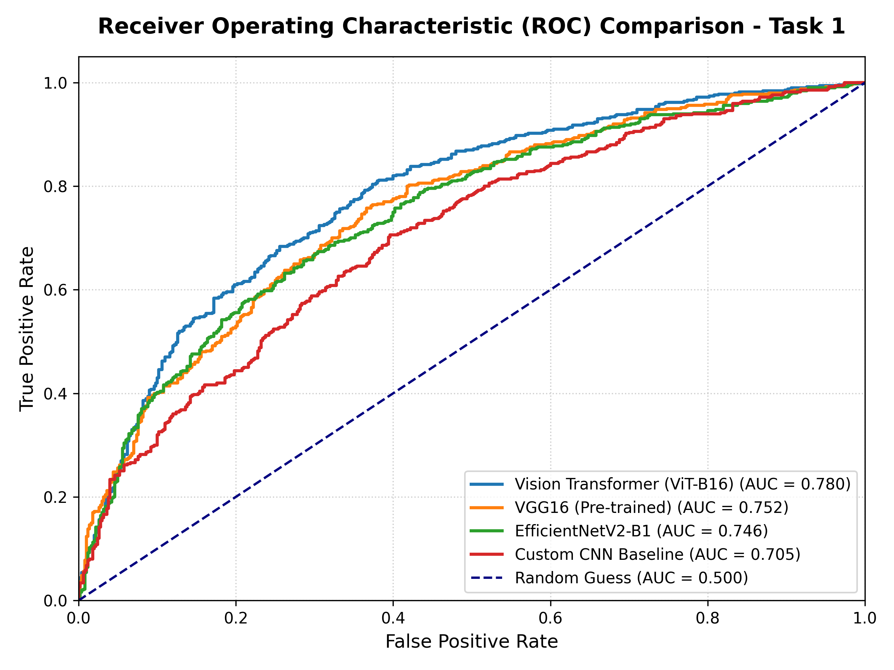

# Skin Lesion Classification for Cancer Diagnosis using Deep Learning

This repository contains the code and implementation of my MSc AI Dissertation, which compares the performance of classical Convolutional Neural Networks (CNNs), VGG16, EfficientNetV2, and Vision Transformers (ViT) in classifying skin cancer lesions. 

The classification is split into two primary tasks using the ISIC skin lesion dataset:
* **Task 1: Melanoma vs. Keratosis & Nevus** (Classifying malignant Melanoma against benign lesions).
* **Task 2: Keratosis vs. Melanoma & Nevus** (Classifying Seborrheic Keratosis against other lesions).

---

## 🚀 Key Features of the Project
This repository is a showcase-ready, refined implementation of deep learning architectures for skin cancer classification:
- **End-to-End ML Pipeline**: Preprocessing raw images, applying advanced augmentations, and serializing them into high-performance TFRecord datasets.
- **Multi-Model Comparison**: Evaluates and compares Custom CNN baseline, pre-trained VGG16, EfficientNetV2-B1, and Vision Transformer (ViT-B16).
- **5-Fold Cross-Validation**: Implements rigorous cross-validation to evaluate model performance across multiple metrics.
- **Modularized Codebase**: Organizes core preprocessing pipelines and Keras model definitions into a reusable `src/` library.
- **Rich Evaluations**: Incorporates multiple metrics tracking (Accuracy, Precision, Recall, F1, ROC-AUC) and visualizes predictions directly.

---

## 📊 Models & Architecture Compare
The project evaluates and compares four different deep learning architectures on the skin lesion classification tasks:

1. **Custom CNN**: A baseline convolutional model incorporating Dropout and Batch Normalization layers.
2. **VGG16**: A pre-trained VGG16 network fine-tuned with customized classification heads.
3. **EfficientNetV2-B1**: An optimized, resource-efficient model leveraging progressive learning and neural architecture search.
4. **Vision Transformer (ViT-B16)**: A state-of-the-art transformer architecture applying self-attention mechanisms to image patches.

---

## 📈 Evaluation Metrics & Performance
Models are evaluated using 5-Fold Cross-Validation across multiple metrics including Accuracy, Precision, Recall, F1-Score, and ROC-AUC.

### 📊 Performance Comparison Table (Task 1: Melanoma vs. Keratosis & Nevus)

| Model Architecture | Accuracy | Precision | Recall | F1-Score | ROC-AUC |
| :--- | :---: | :---: | :---: | :---: | :---: |
| **Custom CNN** | 0.806 | 0.815 | 0.800 | 0.807 | - |
| **VGG16 (Pre-trained)** | 0.843 | 0.873 | 0.843 | 0.831 | 0.757 |
| **EfficientNetV2-B1** | 0.812 | 0.820 | 0.810 | 0.815 | 0.742 |
| **Vision Transformer (ViT-B16)** | 0.690 | 0.898 | 0.693 | 0.782 | **0.780** |

<p align="center">
  
</p>

---

## 🛠️ Installation & Setup

### 1. Clone the repository:
```bash
git clone https://github.com/alinawrozie/skin-cancer-classification.git
cd skin-cancer-classification
```

### 2. Dataset Placement:
Ensure your dataset files are placed in a sibling directory named `dataset` (or modify paths as needed):
```text
dissertation-901/
├── 22-24_CE901-CE911-CF981-SU_nawrozie_abdul_a/  <-- Repository Root
└── dataset/
    ├── task1/
    │   ├── train/
    │   ├── val/
    │   └── test/
    └── task2/
```

### 3. Generate TFRecords:
Open and run [DataExploration.ipynb](DataExploration.ipynb) to clean the images, perform augmentations, and serialize them into high-performance TFRecord files.

### 4. Train and Evaluate Models:
Navigate to the respective directories under Task 1 or Task 2 and execute the Jupyter Notebooks (e.g., [ViT-B16.ipynb](1%20Melanoma%20vs%20Keratosis%20and%20Nevus/ViT-B16/ViT-B16.ipynb)) to train and load cross-validation fold weights.
