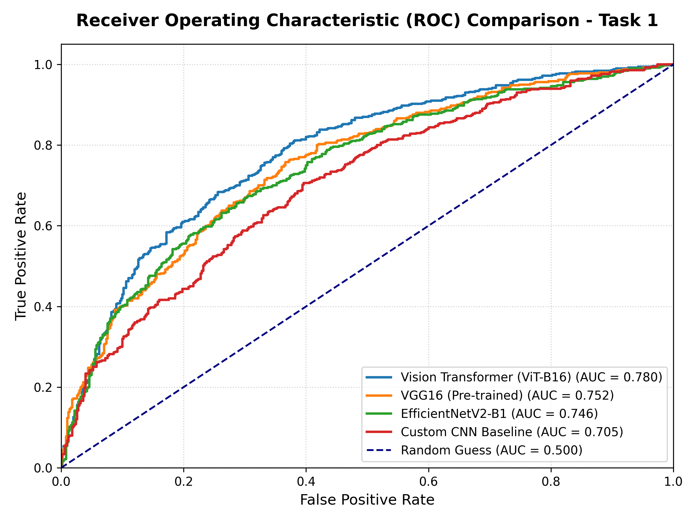
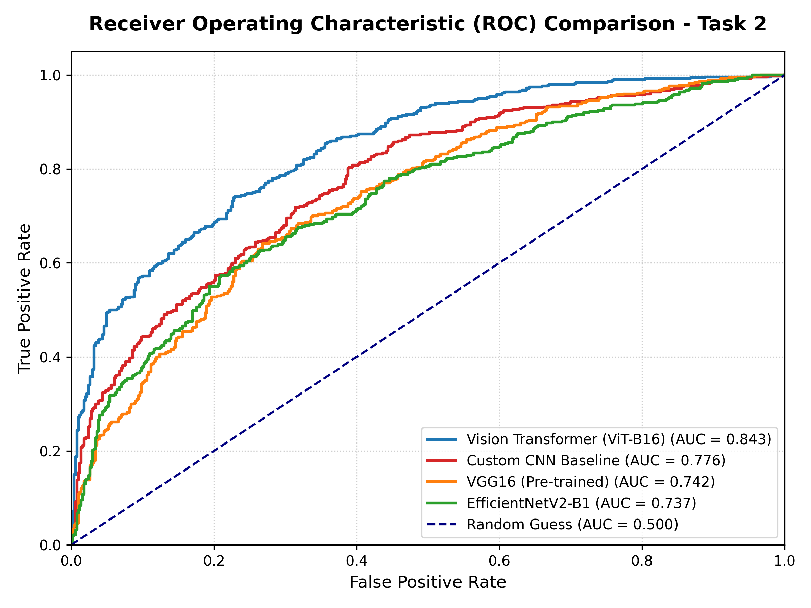

# Skin Lesion Classification for Cancer Diagnosis using Deep Learning

This repository contains the code and implementation of my MSc AI Dissertation, which compares the performance of classical Convolutional Neural Networks (CNNs), VGG16, EfficientNetV2, and Vision Transformers (ViT) in classifying skin cancer lesions. 

The classification is split into two primary tasks using the ISIC skin lesion dataset:
* **Task 1: Melanoma vs. Keratosis & Nevus** (Classifying malignant Melanoma against benign lesions).
* **Task 2: Keratosis vs. Melanoma & Nevus** (Classifying Seborrheic Keratosis against other lesions).

---

## 🚀 Key Features of the Project
This repository is a showcase-ready, refined implementation of deep learning architectures for skin cancer classification:
- **End-to-End ML Pipeline**: Preprocessing raw images, applying advanced augmentations, and serializing them into high-performance TFRecord datasets.
- **Multi-Model Comparison**: Evaluates and compares Custom CNN baseline, pre-trained VGG16, EfficientNetV2-B1, and Vision Transformer (ViT-B16).
- **PyTorch Retrain of ViT-B16**: Colab notebooks retrain the ViT with `timm`, mixed precision, label smoothing and class-balanced sampling; a 5-fold ensemble reaches ROC-AUC **0.864** (melanoma) and **0.926** (seborrheic keratosis) on the ISIC 2017 test set.
- **5-Fold Cross-Validation**: Implements rigorous cross-validation to evaluate model performance across multiple metrics.
- **Modularized Codebase**: Organizes core preprocessing pipelines and Keras model definitions into a reusable `src/` library.
- **Rich Evaluations**: Incorporates multiple metrics tracking (Accuracy, Precision, Recall, F1, ROC-AUC) and visualizes predictions directly.

---

## 📊 Models & Architecture Compare
The project evaluates and compares four different deep learning architectures on the skin lesion classification tasks:

1. **Custom CNN**: A baseline convolutional model incorporating Dropout and Batch Normalization layers.
2. **VGG16**: A pre-trained VGG16 network fine-tuned with customized classification heads.
3. **EfficientNetV2-B1**: An optimized, resource-efficient model leveraging progressive learning and neural architecture search.
4. **Vision Transformer (ViT-B16)**: A state-of-the-art transformer architecture applying self-attention mechanisms to image patches.

---

## 📈 Evaluation Metrics & Performance
Models are evaluated using 5-Fold Cross-Validation across multiple metrics including Accuracy, Precision, Recall, F1-Score, and ROC-AUC.

### 🔁 ViT-B16 Retrained in PyTorch (Latest Results)
The ViT was retrained in PyTorch in Google Colab ([Task 1 notebook](1%20Melanoma%20vs%20Keratosis%20and%20Nevus/ViT-B16/ViT-B16-PyTorch.ipynb), [Task 2 notebook](2%20Keratosis%20vs%20Melanoma%20and%20Nevus/ViT-B16/ViT-B16-PyTorch.ipynb)). For each task, five models are trained with 5-fold stratified cross-validation on the 2,000 ISIC 2017 training images, then evaluated on the 600-image ISIC 2017 test set (117 melanoma, 90 seborrheic keratosis, 393 nevus). The ensemble averages the five models' predicted probabilities.

**ROC-AUC on the test set**

| Task | Fold 1 | Fold 2 | Fold 3 | Fold 4 | Fold 5 | Mean of folds | 5-fold ensemble |
| :--- | :---: | :---: | :---: | :---: | :---: | :---: | :---: |
| **Task 1: Melanoma** | 0.816 | 0.808 | 0.843 | 0.837 | 0.845 | 0.830 | **0.864** |
| **Task 2: Seborrheic Keratosis** | 0.875 | 0.913 | 0.914 | 0.889 | 0.922 | 0.903 | **0.926** |

Test-time augmentation (flips and a 180° rotation) gave 0.862 on Task 1, so it did not improve on the plain ensemble.

**5-fold ensemble at a 0.5 decision threshold** (lesion = the task's target class)

| Task | Accuracy | Lesion Precision | Lesion Recall | Lesion F1 | F1 (Macro) |
| :--- | :---: | :---: | :---: | :---: | :---: |
| **Task 1: Melanoma** | 0.848 | 0.620 | 0.573 | 0.596 | 0.751 |
| **Task 2: Seborrheic Keratosis** | 0.850 | 0.500 | 0.844 | 0.628 | 0.767 |

> **Class order:** `ImageFolder` numbers classes alphabetically, so class 0 is the target lesion (melanoma in Task 1, seborrheic keratosis in Task 2) and the model's sigmoid output is the probability of class 1, the other lesions. The confusion-matrix titles in the notebooks label the classes the other way round; the tables above use the correct mapping.

**Training setup:** `timm` `vit_base_patch16_224` (ImageNet-pretrained) with a small head (BatchNorm → 32-unit GELU layer → one logit); 224×224 inputs with flips, rotation, shift, zoom, shear and colour jitter; Adam with a one-cycle learning-rate schedule (peak 1e-4, 20% warm-up) for 15 epochs per fold; label smoothing of 0.05, class-balanced sampling and mixed precision. Each fold keeps the epoch with the best validation AUC.

### 🧪 Original Four-Model Comparison (TensorFlow/Keras)
The tables below come from the original TensorFlow/Keras notebooks, which benchmarked all four architectures. The ViT had the best ROC-AUC on both tasks.

#### 📊 Performance Comparison Table (Task 1: Melanoma vs. Seborrheic Keratosis & Nevus)

| Model Architecture | Accuracy | Precision (Macro) | Recall (Macro) | F1-Score (Macro) | ROC-AUC |
| :--- | :---: | :---: | :---: | :---: | :---: |
| **Custom CNN (with Dropout)** | **0.803** | 0.618 | 0.508 | 0.469 | 0.608 |
| **VGG16 (Stratified KFold)** | 0.694 | 0.542 | 0.540 | 0.528 | 0.572 |
| **EfficientNetV2-B1 (Stratified KFold)** | 0.604 | 0.567 | 0.636 | 0.557 | 0.659 |
| **Vision Transformer (ViT-B16)** | 0.697 | **0.703** | **0.794** | **0.686** | **0.769** |

<p align="center">
  
</p>

#### 📊 Performance Comparison Table (Task 2: Seborrheic Keratosis vs. Melanoma & Nevus)

| Model Architecture | Accuracy | Precision (Macro) | Recall (Macro) | F1-Score (Macro) | ROC-AUC |
| :--- | :---: | :---: | :---: | :---: | :---: |
| **Custom CNN (with Dropout)** | **0.861** | 0.733 | 0.616 | 0.644 | 0.776 |
| **VGG16 (Pre-trained)** | 0.625 | 0.594 | 0.683 | 0.555 | 0.742 |
| **EfficientNetV2-B1 (Stratified KFold)** | 0.684 | 0.601 | 0.688 | 0.579 | 0.735 |
| **Vision Transformer (ViT-B16)** | 0.775 | **0.757** | **0.875** | **0.764** | **0.844** |

<p align="center">
  
</p>

---

## 🛠️ Installation & Setup

### 1. Clone the repository:
```bash
git clone https://github.com/alinawrozie/skin-cancer-classification.git
cd skin-cancer-classification
```

### 2. Dataset Placement:
Ensure your dataset files are placed in a sibling directory named `dataset` (or modify paths as needed):
```text
dissertation-901/
├── 22-24_CE901-CE911-CF981-SU_nawrozie_abdul_a/  <-- Repository Root
└── dataset/
    ├── task1/
    │   ├── train/
    │   ├── val/
    │   └── test/
    └── task2/
```

### 3. Generate TFRecords:
Open and run [DataExploration.ipynb](DataExploration.ipynb) to clean the images, perform augmentations, and serialize them into high-performance TFRecord files.

### 4. Train and Evaluate Models:
Navigate to the respective directories under Task 1 or Task 2 and execute the Jupyter Notebooks (e.g., [ViT-B16.ipynb](1%20Melanoma%20vs%20Keratosis%20and%20Nevus/ViT-B16/ViT-B16.ipynb)) to train and load cross-validation fold weights.

### 5. Retrain ViT-B16 in PyTorch (Google Colab):
Open a `ViT-B16-PyTorch.ipynb` notebook in Google Colab with a GPU runtime. The notebooks expect `dataset.zip` in `MyDrive/MSc AI/dissertation/` on Google Drive, holding `dataset/task1/` and `dataset/task2/`, each with `train/` and `test/` folders and one sub-folder per class. They install their own dependencies (PyTorch, torchvision, `timm`, scikit-learn) and save each fold's best weights to `saved_models/` (Task 1) or `saved_models_task2/` (Task 2).
